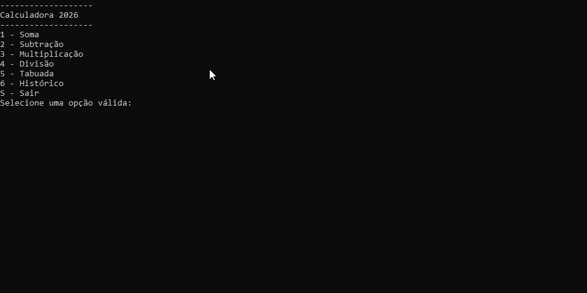

# Jogo de Adivinhação



## Projeto

Desenvolvido durante o curso Fullstack da [Academia do Programador](https://www.academiadoprogramador.net) 2026

## Detalhes

No início do jogo, é gerado um número secreto aleatório entre 1 e 20. Os jogadores devem então tentar adivinhar esse número dentro de um número limitado de tentativas, que varia de acordo com a dificuldade escolhida. A cada tentativa errada, dicas são fornecidas para ajudar a direcionar as próximas tentativas.

Os níveis de dificuldade serão: 

1. Fácil = 15 chances 
2. Médio = 10 chances 
3. Difícil = 5 chances

## Entrada

Os jogadores interagem com o jogo por meio do console, digitando números e recebendo feedback instantâneo sobre suas escolhas. O jogo termina quando o jogador adivinha o número secreto ou quando todas as tentativas são esgotadas.

## Funcionalidades

- **Geração de Número Secreto:** No início de cada jogo, um número secreto é gerado aleatoriamente entre 1 e 20.
- **Seleção de Dificuldade:** Os jogadores podem escolher entre três níveis de dificuldade (Fácil, Médio, Difícil), que influenciam o número de tentativas disponíveis.
- **Feedback Instantâneo:** Após cada tentativa, o jogo fornece feedback indicando se o número escolhido é maior ou menor que o número secreto.

## Como utilizar o programa

1. Clone o repositório ou baixe o código comprimido em .zip.
2. Abra o emulador de terminal e navegue até a pasta raiz.
3. Utilize o comando abaixo para restaurar as dependências do projeto.

   ```
   dotnet restore
   ```

4. Em seguida compile e execute o projeto com o comando:

   ```
   dotnet run --project JogoDeAdivinhacao.ConsoleApp
   ```

## Requisitos

- .NET SDK 10.0